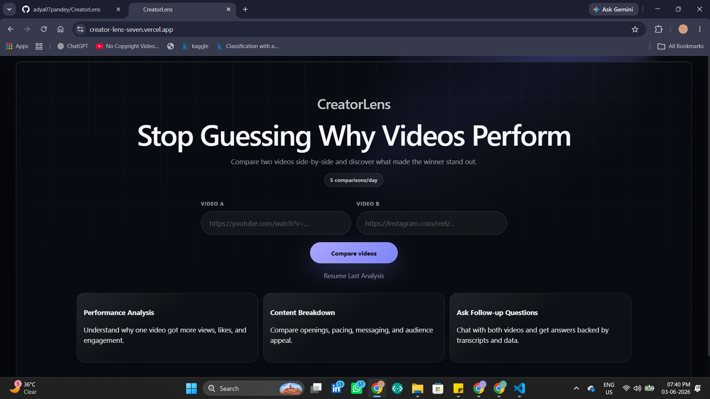
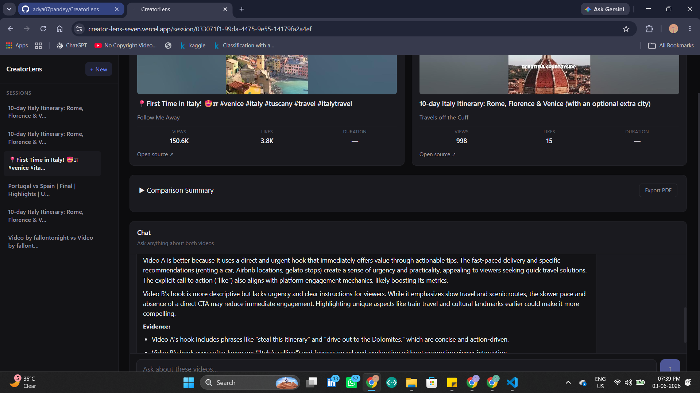
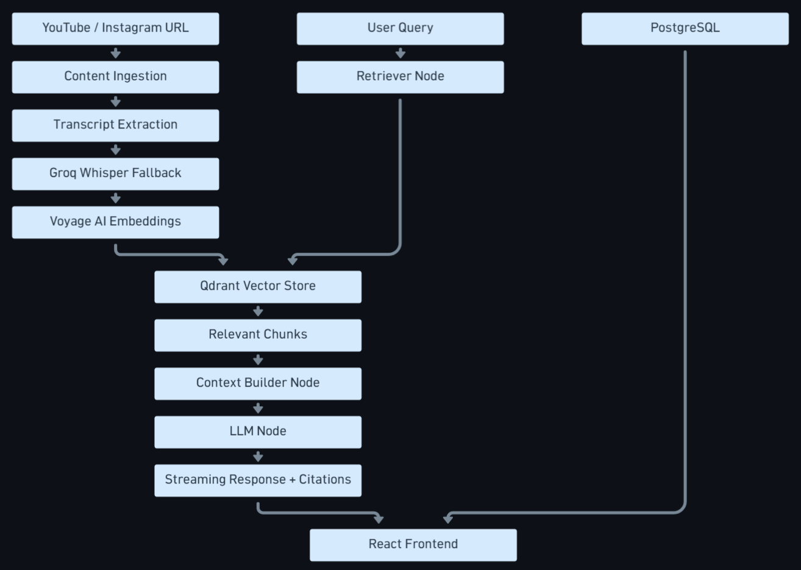

# CreatorLens — RAG Chatbot for YouTube & Instagram Content

A full-stack RAG (Retrieval-Augmented Generation) chatbot that ingests YouTube videos and Instagram Reels, transcribes them, and lets you have multi-turn conversations about the content with source citations and engagement analytics.

**Live Demo:** https://creator-lens-seven.vercel.app/

---

## Screenshots

**Landing Page**


**Chat Page**


---

## Features

- **Multi-platform ingestion** — YouTube videos and Instagram Reels
- **Multi-turn chat** with streaming responses and source citations
- **Engagement analytics** — views, likes, comments, follower count per video
- **Content insights** — summary, hook analysis, CTA detection, speech pace
- **PDF report export** — generate downloadable reports per session
- **Session management** — UUID-based sessions, persistent chat history
- **Semantic search** — Voyage AI embeddings + Qdrant vector store

---

## System Architecture



--- 

## Architecture

```
Frontend (React + Vite)
    │
    ▼
Backend (FastAPI + LangGraph)
    ├── Ingestion Pipeline
    │   ├── YouTube  → YouTube Data API v3 (metadata + transcript)
    │   │              Rapid API (audio download) → Groq Whisper (fallback)
    │   └── Instagram → Apify Reel Scraper (metadata + transcript)
    │                   yt-dlp audio download → Groq Whisper (fallback)
    │
    ├── Embedding & Storage
    │   ├── Voyage AI voyage-3-lite (512-dim embeddings)
    │   └── Qdrant (vector store, payload-filtered retrieval)
    │
    ├── LangGraph Agent
    │   ├── Retriever node (Qdrant similarity search)
    │   ├── Context builder node
    │   └── LLM node (qwen/qwen3-32b, SSE streaming)
    │
    └── PostgreSQL (sessions, messages, metadata, insights)
```

---

## Tech Stack

| Layer | Technology |
|---|---|
| Frontend | React, Vite, CSS Modules |
| Backend | FastAPI, LangGraph, SQLAlchemy |
| LLM | qwen3-32b (OpenRouter) |
| Embeddings | Voyage AI `voyage-3-lite` (512 dims) |
| Vector Store | Qdrant Cloud |
| Database | PostgreSQL |
| YouTube Metadata | YouTube Data API v3 |
| YouTube Transcript | Rapid API → Groq Whisper fallback |
| Instagram Scraping | Apify `instagram-reel-scraper` |
| Audio Transcription | Groq `whisper-large-v3-turbo` |
| PDF Export | ReportLab |
| Hosting | Render | Vercel |

---

## Ingestion Pipeline

### YouTube
```
YouTube Data API v3 (metadata + transcript)
            └── RapidAPI ytjar audio download → Groq Whisper (fallback)
```

### Instagram
```
Apify instagram-reel-scraper (metadata + transcript)
    └── yt-dlp audio download → Groq Whisper (fallback)
```

---

## Performance

Measured on Render free tier (512MB RAM):

| Operation | Latency |
|---|---|
| YouTube metadata + transcript | ~19.76s |
| Instagram ingest (Apify) | ~6.19s |
| Audio download | ~1.20s |
| Whisper transcription (Groq) | ~0.49s |
| Qdrant retrieval | ~0.37s |
| LLM first token | ~10.51s |
| Stream completed | ~12.01s |
| Full ingest pipeline | ~43s |
| Chat stream end-to-end | ~12.44s |
| PostgreSQL save | ~0.04s |

---

## Project Structure

```
├── backend/
│   ├── app/
│   │   ├── api/                  # FastAPI route handlers
│   │   │   ├── chat_stream.py    # SSE streaming chat
│   │   │   ├── ingest.py         # Video ingestion endpoint
│   │   │   ├── sessions.py       # Session management
│   │   │   └── pdf.py            # PDF report export
│   │   ├── graph/                # LangGraph agent
│   │   │   ├── workflow.py       # Graph definition
│   │   │   ├── nodes.py          # Retriever, context, LLM nodes
│   │   │   └── states.py         # State schema
│   │   ├── services/
│   │   │   ├── ingestion/        # YouTube & Instagram ingest orchestrators
│   │   │   ├── embeddings/       # Voyage AI embedder
│   │   │   ├── retrieval/        # Qdrant retriever + context builder
│   │   │   ├── transcript/       # Transcript fetchers + Groq Whisper
│   │   │   ├── metadata/         # Platform metadata fetchers
│   │   │   ├── insights/         # Summary, hooks, CTA, speech pace
│   │   │   └── vectorstore/      # Qdrant client wrapper
│   │   ├── db/                   # SQLAlchemy models + CRUD
│   │   └── utils/                # Chunker, metadata normalizer, cleanup
│   └── requirements.txt
│
├── frontend/
│   ├── src/
│   │   ├── components/
│   │   │   ├── Chat/             # ChatPanel, ChatInput, Message
│   │   │   ├── VideoCard/        # Video card with engagement metrics
│   │   │   ├── Summary/          # Content insights panel
│   │   │   └── Sidebar/          # Session list
│   │   ├── pages/                # Home, Session
│   │   ├── api/                  # API client functions
│   │   └── hooks/                # useChat, useSessions
│   └── package.json
│
└── docker/
    └── docker-compose.yml
```

---

## Environment Variables

### Backend `.env`

```env
# LLM
OPENROUTER_API_KEY=

# Embeddings
VOYAGE_API_KEY=

# Vector Store
QDRANT_URL=
QDRANT_API_KEY=

# Database
DATABASE_URL=

# YouTube
YOUTUBE_API_KEY=

# Instagram / YouTube scraping
APIFY_API_TOKEN=

# Transcript
GROQ_API_KEY=
RAPIDAPI_KEY=
```

---

## Local Development

### Prerequisites
- Python 3.11+
- Node.js 18+
- Docker (optional, for Qdrant + PostgreSQL)

### Backend

```bash
cd backend
python -m venv venv
source venv/bin/activate  # Windows: venv\Scripts\activate
pip install -r requirements.txt
uvicorn app.main:app --reload --port 8000
```

### Frontend

```bash
cd frontend
npm install
npm run dev
```

### Docker (Qdrant + PostgreSQL)

```bash
docker-compose -f docker/docker-compose.yml up -d
```

---

## API Endpoints

| Method | Endpoint | Description |
|---|---|---|
| POST | `/api/ingest` | Ingest YouTube or Instagram URLs |
| POST | `/api/chat/stream` | Streaming chat (SSE) |
| GET | `/api/` | List sessions for user |
| GET | `/api/session/{id}/details` | Session metadata + videos |
| GET | `/api/{session_id}` | Chat history |
| POST | `/api/pdf/{session_id}` | Generate PDF report |
